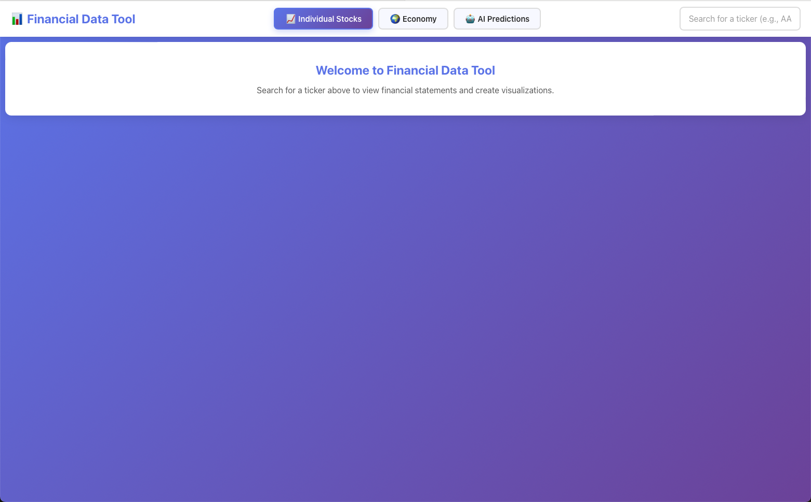
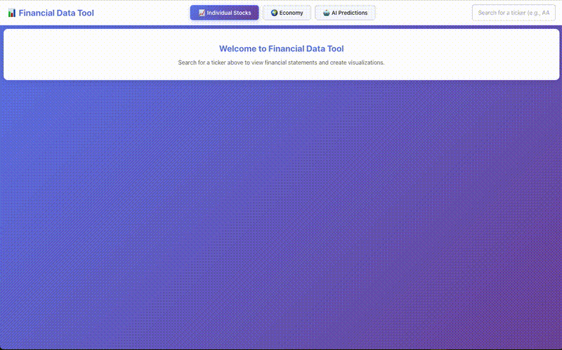

# 📊 Financial Data Analysis Tool

> A comprehensive platform for analyzing and visualizing financial statements from publicly traded companies, powered by SEC EDGAR data, AI predictions, and macroeconomic indicators.

<!-- 
  PLACEHOLDER: Main application demo
  FILE TO ATTACH: GIFs/main_app_demo.gif
  DESCRIPTION: Screen recording showing the main application interface with all tabs (Financial Data, AI, Economy)
-->


---

## 🚀 Features

### 📈 Financial Data Analysis
- **Real-time Data Collection**: Fetch financial statements directly from SEC EDGAR API
- **Comprehensive Coverage**: Income statements, balance sheets, and cash flow statements
- **Multi-year Analysis**: Historical data spanning 15+ years
- **Interactive Tables**: Sortable, filterable financial data tables
- **Dynamic Charts**: Create custom charts with multiple metrics and comparison tickers
- **Drag & Resize**: Moveable and resizable chart panels for custom layouts

<!-- 
  PLACEHOLDER: Financial data table and chart demo
  FILE TO ATTACH: GIFs/financial_data_demo.gif
  DESCRIPTION: Demo showing searching for a ticker, viewing financial tables, and creating comparison charts
-->


<video src="GIFs/BirdView_search_for_stock.mp4" controls width="800"></video>


### 🤖 AI-Powered Predictions
- **LSTM Price Forecasting**: 11-day stock price predictions using neural networks
- **GARCH Volatility Analysis**: Advanced volatility modeling and forecasting
- **Market Indices Tracking**: Real-time tracking of SPY, DJIA, NDAQ, and IWM
- **Model Performance Metrics**: Detailed evaluation metrics and training loss visualization

<!-- 
  PLACEHOLDER: AI predictions demo
  FILE TO ATTACH: GIFs/ai_predictions_demo.gif
  DESCRIPTION: Demo showing LSTM forecast and GARCH volatility analysis with interactive charts
-->


### 🌍 Macroeconomic Dashboard
- **Commodities**: Energy, metals, agricultural, livestock, and industrial commodities
- **Currencies**: Major global currency exchange rates
- **Economic Indicators**: Inflation (CPI), debt-to-GDP, dollar index, money velocity
- **Labor Market**: Unemployment rates and trends
- **Real Estate**: Housing market indicators
- **Bond Markets**: Global bond yields across regions

<!-- 
  PLACEHOLDER: Economy dashboard demo
  FILE TO ATTACH: GIFs/economy_dashboard_demo.gif
  DESCRIPTION: Demo showing various economic indicators with resizable/moveable charts
-->


### ⚡ Advanced UI Features
- **Resizable Panels**: All charts and visualizations can be resized
- **Draggable Layout**: Arrange charts to create custom dashboard layouts
- **Multi-Ticker Comparison**: Compare up to multiple tickers simultaneously (comma-separated)
- **Real-time Progress Tracking**: Live progress updates during data collection
- **Smart Caching**: JSON-based caching for instant data retrieval

<!-- 
  PLACEHOLDER: UI features demo
  FILE TO ATTACH: GIFs/ui_features_demo.gif
  DESCRIPTION: Demo showing dragging, resizing, and multi-ticker comparison features
-->


---

## 🏗️ Architecture

### Backend (Python)
- **FastAPI**: High-performance REST API framework
- **Data Collection Service**: Automated SEC EDGAR data fetching and processing
- **AI/ML Endpoints**: LSTM and GARCH model serving
- **Macro Data Integration**: Economic indicators from multiple sources
- **Smart Caching**: Automatic CSV cleanup after JSON caching

<!-- 
  PLACEHOLDER: Architecture diagram
  FILE TO ATTACH: images/architecture_diagram.png
  DESCRIPTION: System architecture diagram showing frontend, backend, data collection, and external APIs
-->


### Frontend (React)
- **React 18**: Modern component-based UI
- **Recharts**: Interactive financial charts
- **Plotly.js**: Advanced plotting for AI/ML visualizations
- **Axios**: API communication
- **Draggable/Resizable Components**: Custom panel system

### Data Collection Pipeline
1. **SEC EDGAR API**: Raw financial data retrieval
2. **XML/XBRL Parsing**: Financial statement extraction
3. **Data Normalization**: Standardized format conversion
4. **Multi-year Merging**: Consolidated historical data
5. **JSON Caching**: Optimized storage and retrieval

<!-- 
  PLACEHOLDER: Data flow diagram
  FILE TO ATTACH: images/data_flow_diagram.png
  DESCRIPTION: Flowchart showing data collection, processing, caching, and delivery pipeline
-->


---

## 📦 Installation

### Prerequisites
- Python 3.8+
- Node.js 14+
- npm or yarn

### Backend Setup

```bash
# Navigate to backend directory
cd backend

# Create virtual environment
python -m venv venv
source venv/bin/activate  # On Windows: venv\Scripts\activate

# Install dependencies
pip install -r requirements.txt

# Run the server
uvicorn app.main:app --reload --port 8000
uvicorn app.main:app --reload --host 0.0.0.0 --port 8000
```

### Frontend Setup

```bash
# Navigate to frontend directory
cd frontend

# Install dependencies
npm install

# Start development server
npm start
```

The application will be available at `http://localhost:3000`

---

## 🎯 Usage

### Searching for Stock Data

1. **Enter a ticker symbol** (e.g., AAPL, GOOGL, MSFT)
2. **Click "Search"** or press Enter
3. **View financial statements** in interactive tables
4. **Create custom charts** using the Chart Builder

### Creating Comparison Charts

1. **Select metrics** from the financial table
2. **Choose chart type** (Line, Bar, Area)
3. **Add comparison tickers** (comma-separated: AMZN,GOOGL,MSFT)
4. **Click "Add Chart"** to generate visualization
5. **Drag and resize** the chart panel as needed

### Running AI Predictions

1. **Navigate to AI tab**
2. **Enter ticker symbol**
3. **Select model** (Price Forecast or Volatility)
4. **Click "Run Model"** and wait 30-60 seconds
5. **Interact with results** - drag and resize charts

### Exploring Economic Data

1. **Navigate to Economy tab**
2. **Select category** (Commodities, Currencies, etc.)
3. **View interactive charts**
4. **Resize and reposition** for custom layout

---

## 🛠️ Technologies

### Backend
- **FastAPI** - Modern Python web framework
- **Pandas** - Data manipulation and analysis
- **NumPy** - Numerical computing
- **yfinance** - Yahoo Finance data
- **requests** - HTTP library
- **Beautiful Soup** - XML/HTML parsing
- **TensorFlow/Keras** - Deep learning (LSTM)
- **arch** - GARCH volatility modeling

### Frontend
- **React** - UI framework
- **Axios** - HTTP client
- **Recharts** - Charting library
- **Plotly.js** - Scientific plotting
- **React Router** - Navigation
- **Bootstrap** - CSS framework

### Data Sources
- **SEC EDGAR API** - Financial statements
- **Yahoo Finance** - Stock prices and indices
- **FRED** - Economic indicators
- **Alpha Vantage** - Additional market data

---

## 📁 Project Structure

```
financial_data_tool/
├── backend/
│   ├── app/
│   │   ├── main.py              # FastAPI application
│   │   ├── data.py              # Financial data endpoints
│   │   ├── ai_endpoints.py      # AI/ML model endpoints
│   │   ├── macro_endpoints.py   # Economic data endpoints
│   │   └── data_collection_service.py
│   └── api/
│       └── cached_statements/   # JSON cache storage
├── frontend/
│   ├── src/
│   │   ├── components/
│   │   │   ├── FinancialTable.js
│   │   │   ├── ChartManager.js
│   │   │   ├── AIView.js
│   │   │   ├── MacroView.js
│   │   │   └── DraggableResizablePanel.js
│   │   └── App.js
│   └── public/
├── data-collection/
│   └── scripts/
│       ├── main.py              # Data collection entry point
│       ├── Company.py
│       ├── Filling.py
│       └── FinancialStatement.py
├── AI_ML/
│   ├── AI/
│   │   └── stock_forecaster.py  # LSTM implementation
│   └── Macro/
│       └── macro_data.py         # Economic data fetchers
├── GIFs/                         # Demo GIFs (TO BE ADDED)
├── images/                       # Documentation images (TO BE ADDED)
└── README.md
```

---

## 🔧 Configuration

### Environment Variables

Create a `.env` file in the backend directory:

```env
# API Keys (if needed)
ALPHA_VANTAGE_KEY=your_key_here
FRED_API_KEY=your_key_here

# Server Configuration
HOST=0.0.0.0
PORT=8000
```

### Caching Configuration

By default, CSV files are cleaned up after JSON caching. To disable this:

```python
# In data_collection_service.py
cleanup_csv=False  # Set to False to keep CSV files
```

---

## 🤝 Contributing

Contributions are welcome! Please follow these steps:

1. Fork the repository
2. Create a feature branch (`git checkout -b feature/AmazingFeature`)
3. Commit your changes (`git commit -m 'Add some AmazingFeature'`)
4. Push to the branch (`git push origin feature/AmazingFeature`)
5. Open a Pull Request


---


## 📸 Media Assets Checklist

To complete this README, please add the following files:

### GIFs (Screen Recordings)
- [ ] `GIFs/main_app_demo.gif` - Full application overview (30-60 seconds)
- [ ] `GIFs/financial_data_demo.gif` - Financial data search and charting (20-30 seconds)
- [ ] `GIFs/ai_predictions_demo.gif` - AI model predictions demo (30-45 seconds)
- [ ] `GIFs/economy_dashboard_demo.gif` - Economic indicators dashboard (20-30 seconds)
- [ ] `GIFs/ui_features_demo.gif` - Drag, resize, and multi-ticker comparison (20-30 seconds)

### Images (Static Diagrams)
- [ ] `images/architecture_diagram.png` - System architecture diagram
- [ ] `images/data_flow_diagram.png` - Data collection and processing flowchart

### Recording Tips:
- Use a screen recording tool (OBS, QuickTime, etc.)
- Record at 1920x1080 or higher resolution
- Keep file sizes under 10MB per GIF
- Show key features in action
- Include smooth transitions
- Add brief text overlays if helpful
